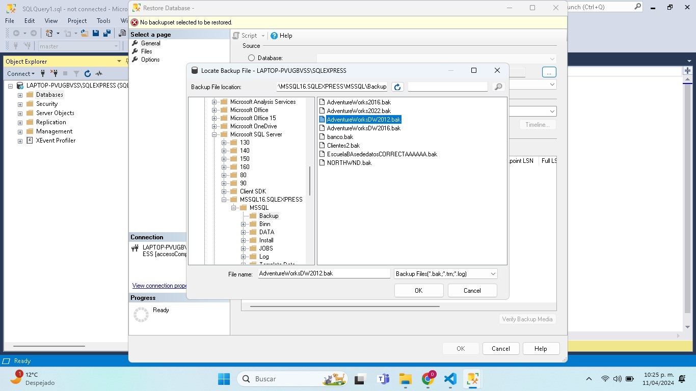
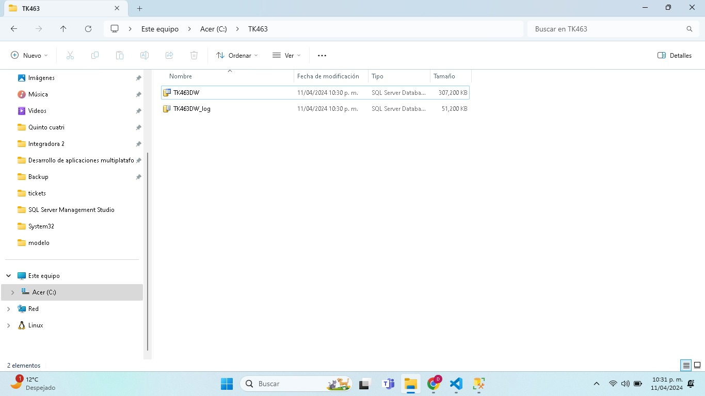

# Cargar la base de datos:
**Se encuentra en la pagina de microsoft**

Lo primero que realicé fue instalar el backup de la respectiva base de datos, 2012. 
Realicé un backup.

Posteriormente, en mi disco local C cree una carpeta con el nombre: TK463

*Es importante esto, ya que de caso contrario, no podremos trabajar*
***
Una vez completado, en sql ejecutamos el siguiente script:
 
```sql
USE master;
IF DB_ID('TK463DW') IS NOT NULL
DROP DATABASE TK463DW;
GO
CREATE DATABASE TK463DW
ON PRIMARY
(NAME = N'TK463DW', FILENAME = N'C:\TK463\TK463DW.mdf',
SIZE = 307200KB , FILEGROWTH = 10240KB )
LOG ON
(NAME = N'TK463DW_log', FILENAME = N'C:\TK463\TK463DW_log.ldf',
SIZE = 51200KB , FILEGROWTH = 10%);
GO
ALTER DATABASE TK463DW SET RECOVERY SIMPLE WITH NO_WAIT;
GO
```

Posteriormente si nos dirigimos a la carpeta, veremos que tenemos los siguientes archivos


***
